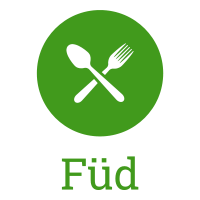

# Füd

## Project Synopsis
Füd is a program that seeks to take you out of your daily health routine and discover new things to make your lifestyle healthier and more enjoyable than ever. Enter and rate your favorite foods, and Füd will recommend similarly tasting and healthy foods to allow you to explore new things while still enjoying your lifestyle.

## Team Members
| Member                | Photo                                         |
| --------------------- | --------------------------------------------- |
| Aitan Grossman        |  |
| Tucker (Kenneth) Haas |  |
| Connor Quinn          |  |
| Kally Zheng           |  |
| Ben Rocklin           |  |

## Team Skills
| Member                | Skills                        | Personal Traits  | Desired Growth | Weaknesses |
| --------------------- | ----------------------------- | ---------------- | -------------- | ---------- |
| Aitan Grossman        | Back end, Web, Algorithms | Cooperative, Pragmatic, Likes cuddling | Iterated development, courage | UI design, no friends |
| Tucker (Kenneth) Haas | Backend, System Architecture, Python, C, C++, Go, Project Management | Cooperative, Honest, Strong Willed | Visual Design, Organization | Obsess over details, Web dev
| Connor Quinn          | Data analysis and visualization, Machine Learning | Gets things done early, communication is everything | Software engineering practices beyond hard code |  The engineering mindset |
| Kally Zheng           | Python, Java, Visual Design, Needfinding |  Organized, Open minded, Motivated | Web Development, Mobile Development | Selfconfidence, ML, NLP
| Ben Rocklin           | Full stack, ML, AI, systems, Java, Python, Typescript | Hardworking, enjoy new programming languages, loves constructing things with code, likes humor | More practical frontend experience, planning | Bad memory, product management, consumer-side work

## Team Communication
* Slack
* [Google Team Drive](https://drive.google.com/drive/u/0/folders/0APuBDtZh-TEUUk9PVA)
* [SGM Worksheet](https://docs.google.com/forms/d/1GayYOwG_QavQE4iNx63emikCSeXUXO9Gq0VRaRGm9ok/edit?usp=sharing)
* @stanford Email
    * ctquinn
    * pranavu
    * sushilu
    * brocklin
    * mcai88
