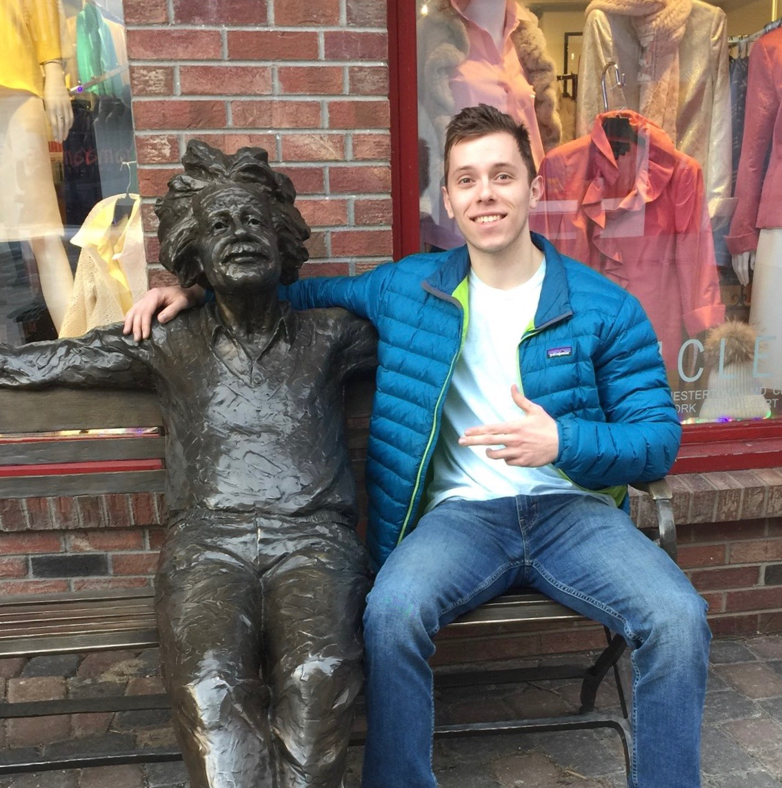

# Diversify.ai

## Project Synopsis
Sous Chef is an app that works with you to make the most of your kitchen inventory. By allowing you to scan in receipts, Sous Chef allows you to easily find new recipes using ingredients you already have, meaning less time running to the store to buy a missing ingredient and more time discovering new and exciting foods. 

## Team Members
| Member                | Photo                                         |
| --------------------- | --------------------------------------------- |
| Aitan Grossman        |  |
| Tucker (Kenneth) Haas |  |
| Connor Quinn           |  |
| Kally Zheng           |  |
| Kally Zheng           |  |

## Team Skills
| Member                | Skills                        | Personal Traits  | Desired Growth | Weaknesses |
| --------------------- | ----------------------------- | ---------------- | -------------- | ---------- |
| Aitan Grossman        | Back end, Web, Algorithms | Cooperative, Pragmatic, Likes cuddling | Iterated development, courage | UI design, no friends |
| Tucker (Kenneth) Haas | Backend, System Architecture, Python, C, C++, Go, Project Management | Cooperative, Honest, Strong Willed | Visual Design, Organization | Obsess over details, Web dev
| Connor Quinn          | Data analysis and visualization, Machine Learning | Gets things done early, communication is everything | Software engineering practices beyond hard code |  The engineering mindset |
| Kally Zheng           | Python, Java, Visual Design, Needfinding |  Organized, Open minded, Motivated | Web Development, Mobile Development | Selfconfidence, ML, NLP
| Kally Zheng           | Python, Java, Visual Design, Needfinding |  Organized, Open minded, Motivated | Web Development, Mobile Development | Selfconfidence, ML, NLP

## Team Communication
* Facebook Messenger
* [Google Team Drive](https://drive.google.com/drive/u/0/folders/0APuBDtZh-TEUUk9PVA)
* [SGM Worksheet](https://docs.google.com/forms/d/1GayYOwG_QavQE4iNx63emikCSeXUXO9Gq0VRaRGm9ok/edit?usp=sharing)
* @stanford Email
    * aitan
    * thaas19
    * stieu12
